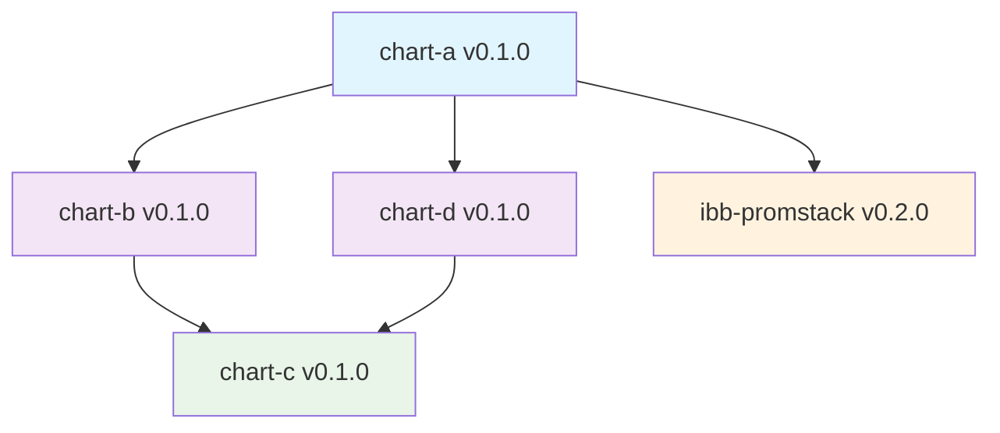

# Helm Chart Dependency Graph

## Visual Dependency Tree

```
chart-a (v0.1.0)
├── chart-b (v0.1.0) [local: file://../chart-b]
│   └── chart-c (v0.1.0) [local: file://../chart-c]
├── chart-d (v0.1.0) [local: file://../chart-d]
│   └── chart-c (v0.1.0) [local: file://../chart-c] ← DUPLICATE
└── ibb-promstack (v0.2.0) [remote: https://ibbproject.github.io/helm-charts/]
```

## Dependency Matrix

| Chart | Dependencies | Type | Repository |
|-------|-------------|------|------------|
| **chart-a** | chart-b, chart-d, ibb-promstack | Top-level | - |
| **chart-b** | chart-c | Intermediate | - |
| **chart-c** | none | Base | - |
| **chart-d** | chart-c | Intermediate | - |
| **ibb-promstack** | unknown | External | Remote |

## Dependency Resolution Order

For `chart-a`, the dependency resolver should process in this order:

1. **chart-c** (base dependency, no further deps)
2. **chart-b** (depends on chart-c, already resolved)
3. **chart-d** (depends on chart-c, already resolved - duplicate detection)
4. **ibb-promstack** (remote dependency)
5. **chart-a** (final assembly)

## Test Scenarios

### 1. Linear Chain Resolution
- chart-a → chart-b → chart-c

### 2. Diamond Dependency Pattern
- chart-a → chart-b → chart-c
- chart-a → chart-d → chart-c (same chart-c)

### 3. Mixed Dependency Types
- Local file dependencies: chart-b, chart-d, chart-c
- Remote repository dependency: ibb-promstack

### 4. Duplicate Detection
- chart-c appears twice in the dependency tree
- Resolver should detect and resolve only once

## Graph Visualization (Mermaid)



## Dependency Paths

1. **chart-a** → **chart-b** → **chart-c**
2. **chart-a** → **chart-d** → **chart-c** (duplicate path to chart-c)
3. **chart-a** → **ibb-promstack** (external dependency)

**Total unique dependencies**: 4 charts (chart-a, chart-b, chart-c, chart-d, ibb-promstack)
**Duplicate dependencies**: 1 (chart-c appears in 2 paths)